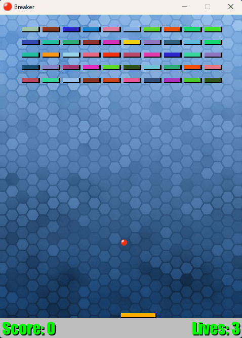

# Breaker
Brick-breaker game written in Python using the PyGame library.  

## How to run
Run `main.py` with python with PyGame installed in your environment.  

## Controls
Hit the ball and do not let it fall!  
- a/w keys move paddle left
- d/s keys move paddle right

Gameplay gif:  

## Goals
- Powerup drops
- Local highscore
- Spacebar to start
