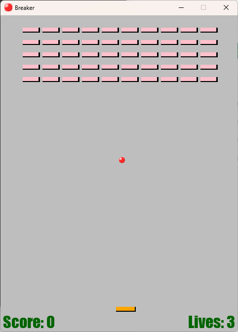

# Breaker
Block breaker demo written in Python using the PyGame library.  

## How to run

Run `main.py` with python with PyGame installed in your environment.  

## Controls
Hit the ball and do not let it fall!  
- a/w keys go left
- d/s keys go right

