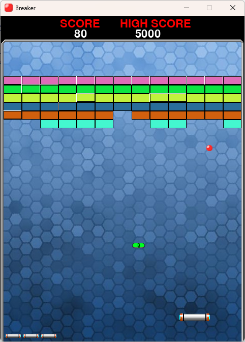

# Breaker
Brick-breaker game inspired by Arkanoid written in Python using the PyGame library.  
Completing a level gets extra points, dense bricks take two hits to break through.  
Winning 2500, 5000, 7500, ... points will earn an extra life.  

## How to run
Install [PyGame](https://www.pygame.org/wiki/GettingStarted)[1] for your Python environment and run with Python `main.py`.

## Controls
Hit the ball and do not let it fall!
- move paddle left: a, w, left-arrow, up-arrow
- move paddle right: d, s, right-arrow, down-arrow
- Exit game: escape

## Goals
- paddle texture
- Powerup drops
- Local highscore store and show
- Spacebar to start

## Sources
[1] PyGame https://www.pygame.org/wiki/GettingStarted  
[2] Arkanoid Levels http://nick-aschenbach.github.io/blog/2015/04/27/arkanoid-game-levels/
